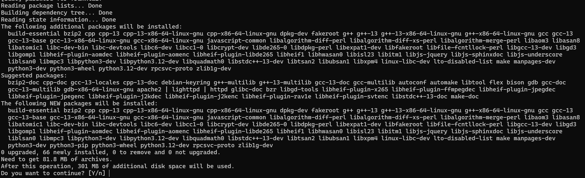

# 尋找最佳 Ubuntu APT Repository Mirror

Ubuntu 24.04 出了，又是來安裝 WSL 的時候(！？)

- [How To Find Best Ubuntu APT Repository Mirror](https://ostechnix.com/how-to-find-best-ubuntu-apt-repository-mirror/)

這篇提到了透過 Ubuntu Software & Updates 的 GUI 介面

以及 apt-select 和 apt-smart

這兩個流程上都是先裝 pip

```
sudo apt install python3-pip

pip3 install apt-select

pip3 install --user apt-smart
```

不過這個安裝 pip 就要勞師動眾啊…就 apt 在慢要換，還得先撐過這一堆，有點…



來看另一篇 [How to select the fastest apt mirror on Ubuntu Linux](https://linuxconfig.org/how-to-select-the-fastest-apt-mirror-on-ubuntu-linux)

mirror protocol

change `deb http://us.archive.ubuntu.com/ubuntu/ focal main restricted` to `deb mirror://mirrors.ubuntu.com/mirrors.txt focal main restricted`

或是直接問

```
curl mirrors.ubuntu.com/mirrors.txt
```

然後剛才才發現 Ubuntu 24.04 的設定檔改版啦

變成 `/etc/apt/sources.list.d/ubuntu.sources`

貼一下 `curl mirrors.ubuntu.com/mirrors.txt` 的結果

```
http://ftp.tku.edu.tw/ubuntu/
http://mirror01.idc.hinet.net/ubuntu/
http://ubuntu.cs.nctu.edu.tw/ubuntu/
http://free.nchc.org.tw/ubuntu/
https://mirror.twds.com.tw/ubuntu-ports/
http://mirror.nwlab.tk/ubuntu/
http://ftp.tw.debian.org/ubuntu/
https://tw1.mirror.blendbyte.net/ubuntu/
http://ftp.mirror.tw/pub/ubuntu/ubuntu/
https://mirror.twds.com.tw/ubuntu/
https://ftp.ubuntu-tw.net/ubuntu/
https://ubuntu.ccns.ncku.edu.tw/ubuntu/
https://mirror.ossplanet.net/ubuntu/
http://archive.ubuntu.com/ubuntu/
```

